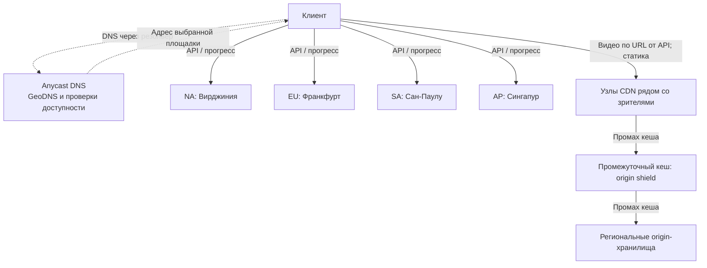

# Проектирование видеостримингового сервиса
## 1. Тема и целевая аудитория

### Тип сервиса

Высоконагруженный видеостриминговый сервис (на примере Netflix).

### Целевая аудитория

В Q4 2024 у Netflix было около 301,6 млн платных подписок [1].

Для проекта принимается MAU = 315 млн пользователей. Ориентир — оценки аудитории Business of Apps и Backlinko [2][3]. Распределение по регионам берётся из отчёта Netflix [1]:

| Регион | Подписчики, млн | Доля |
|---|---:|---:|
| UCAN — США и Канада | 89,63 | 29,7% |
| EMEA — Европа, Ближний Восток и Африка | 101,13 | 33,5% |
| LATAM — Латинская Америка | 53,33 | 17,7% |
| APAC — Азиатско-Тихоокеанский регион | 57,54 | 19,1% |

Данные — Q4 2024, таблица Regional Breakdown на странице 8 отчёта [1]. Доля региона равна числу его подписок, делённому на 301,63 млн. Для расчётов доли округлены до десятых процента; их сумма равна 100%. Доли подписок используются как приближение распределения DAU.

Основная аудитория проекта — зрители 18–49 лет; также предусмотрены детские профили.
### Функционал MVP

- Регистрация и авторизация пользователей
- Просмотр главной страницы с персонализированной лентой рекомендаций
- Поиск и просмотр карточки тайтла (фильм/сериал) с описанием, рейтингом, эпизодами
- Адаптивный видеостриминг с переключением качества (ABR) в зависимости от скорости соединения
- Сохранение прогресса просмотра и синхронизация между устройствами («продолжить просмотр»)
- Список «Мой список» / избранное
- Оценка тайтлов для персонализации рекомендаций
- Написание и просмотр текстовых отзывов на фильмы

### Ключевые продуктовые решения

- Главная страница и рекомендации формируются персонально для каждого профиля на основе истории просмотров и оценок.
- Видео раздаётся через CDN с адаптивным битрейтом (ABR): клиент переключается между заранее подготовленными по HLS/DASH качествами в зависимости от пропускной способности сети.
- Прогресс просмотра сохраняется на сервере каждые 30 секунд и доступен с других устройств после обработки и репликации.
- Оценить тайтл и написать отзыв на фильм можно после окончания просмотра.
- Для каждого фильма пользователь может оставить один отзыв и впоследствии изменить или удалить его. Отзывы выводятся страницами по 10 записей.

## 2. Расчёт нагрузки

### 2.1. Продуктовые метрики

MAU = 315 млн, отношение DAU/MAU = 0,6, частоты действий, размеры записей и коэффициент пика ×3 приняты для модели проекта. Эти значения не являются официальными метриками Netflix.

**MAU и DAU**

| Метрика | Значение | Источник / метод расчёта |
|---|---|---|
| MAU (месячная аудитория) | ≈ 315 млн | Расчётная аудитория проекта; ориентиры — [2][3] |
| DAU (дневная аудитория) | ≈ 189 млн | Допущение: DAU/MAU = 0,6; 315 млн × 0,6. Ориентир для коэффициента — [4] |
| Среднее время просмотра на одного DAU-пользователя в активный день | ≈4 ч | 2,4 ч (средняя по всем аккаунтам и дням) ÷ 0,6 (DAU/MAU) [5] |

**Среднее количество действий пользователя по типам в день**

Частоты действий — допущения модели. Для отзывов принимаем одну загрузку страницы на пользователя в сутки и одну операцию создания, правки или удаления отзыва на 100 активных пользователей в сутки.

| Тип действия | Среднее число на DAU-пользователя в сутки |
|---|---|
| Аутентификация (логин / refresh токена) | 2,0 |
| Открытие главной / ленты рекомендаций | 3,0 |
| Поисковый запрос | 1,5 |
| Открытие карточки тайтла | 5,0 |
| Запуск воспроизведения (фильм/эпизод) | 3,0 |
| Добавление/удаление из «Моего списка» | 0,4 |
| Оценка тайтла | 0,3 |
| Загрузка страницы отзывов | 1,0 |
| Создание, правка или удаление отзыва | 0,01 |

### 2.2. Технические метрики

**Средний размер хранилища пользователя**

Видеокаталог общий для всех пользователей. Начальный объём пользовательских данных оцениваем по среднему числу записей в существующем аккаунте. Для обычной записи принимаем 300 байт, для отзыва — 1 300 байт. Годовой прирост рассчитываем по активности DAU.

| Тип данных | Записей на пользователя | Размер записи | Объём на пользователя |
|---|---:|---:|---:|
| Профиль | 1 | 300 байт | 0,3 КБ |
| «Мой список» | 25 | 300 байт | 7,5 КБ |
| История и прогресс | 300 | 300 байт | 90 КБ |
| Оценки | 60 | 300 байт | 18 КБ |
| Отзывы | 3 | 1 300 байт | 3,9 КБ |
| **Всего** | **389** | | **119,7 КБ** |

Число записей — допущение для оценки текущего хранилища. Средний отзыв содержит 500 символов: около 1 000 байт текста в UTF-8 и 300 байт на идентификаторы, даты и остальные поля.

**Размер хранения по типам данных**

Допущения для каталога: суммарный уникальный каталог (с учётом различий между регионами: 7 600–8 900 тайтлов [6]) — ≈ 10 000 тайтлов; 45% фильмы / 55% сериалы; в среднем 25 эпизодов на сериал; средняя длительность фильма 110 мин, эпизода 48 мин -> 142 000 видеоединиц, ≈ 118 250 часов уникального контента.

| Уровень качества | Объём данных за час |
|---|---:|
| Low, до 480p | 0,3 ГБ/ч |
| SD, 480p | 1 ГБ/ч |
| HD, 720–1080p | 3 ГБ/ч |
| 4K | 7 ГБ/ч |
| **Все версии** | **11,3 ГБ/ч** |

Расход данных по уровням качества — [8].

| Тип данных | Кол-во единиц | Объём, ТБ | Допущения |
|---|---|---|---|
| Видео - раздача | ≈ 142 000 видеоединиц | ≈ 1 336 | ≈11,3 ГБ/час контента по всей лестнице качеств, на основе битрейтов по уровням [8] |
| Видео - архивные мастер-копии (mezzanine) | ≈ 142 000 видеоединиц | ≈ 9 460 | ≈80 ГБ/час — типовой mezzanine-битрейт для архивного хранения |
| Метаданные и превью (описания, постеры, обложки) | ≈ 10 000 тайтлов | ≈ 1 | - |
| Профили, история, избранное и оценки | ≈ 315 млн профилей | ≈ 36,5 | 315 млн × 115,8 КБ |
| Текстовые отзывы | ≈ 945 млн записей | ≈ 1,23 | 315 млн × 3 отзыва × 1 300 байт |
| **Итого** | | **≈ 10 834,7** | | 

### Динамика данных

**Пользовательские данные**

Новый аккаунт содержит только профиль. История, оценки, избранное и отзывы накапливаются по мере использования сервиса. Поэтому прирост рассчитывается по действиям DAU.

Размер обычной записи — **300 байт**, отзыва — **1 300 байт**. Прогресс хранится в одной записи для пары «профиль — видеоединица»: обновление позиции каждые 30 секунд не создаёт новую запись.

Для расчёта запаса считаем просмотры, оценки и отзывы новыми записями, а операции со списком — добавлениями. Это **верхняя оценка**: повторные действия, удаления и очистка истории уменьшат прирост.

| Тип данных | Новых записей на DAU в сутки, до | Размер записи | Прирост при DAU = 189 млн, ГБ/сутки |
|---|---:|---:|---:|
| История и прогресс просмотра | 3 | 300 байт | 170,10 |
| Оценки | 0,3 | 300 байт | 17,01 |
| «Мой список» | 0,4 | 300 байт | 22,68 |
| Отзывы | 0,01 | 1 300 байт | 2,457 |
| **Всего** | **3,71** | | **212,247** |

$$
\Delta V_{day}=\frac{189\cdot10^6\cdot\left(3{,}7\cdot300+0{,}01\cdot1300\right)}{10^9}
=212{,}247\ \text{ГБ/сутки}.
$$

Для прогноза принимаем темп роста аудитории 15,9% в год: `(301,6 − 260,3) / 260,3 ≈ 15,9%` [1][11]. При постоянном отношении DAU/MAU и линейном росте в течение года средний DAU составит:

$$
DAU_{year}=189\cdot10^6\cdot\left(1+\frac{0{,}159}{2}\right)
\approx204{,}03\ \text{млн}.
$$

При отсутствии оттока получаем 50,1 млн новых аккаунтов за год (`315 млн × 15,9%`). На создание профилей потребуется около **15 ГБ/год** (`50,1 млн × 300 байт`). Их дальнейшая активность уже входит в DAU.

$$
\Delta V_{users,year}=
\frac{DAU_{year}\cdot(3{,}7\cdot300+0{,}01\cdot1300)\cdot365
+50{,}1\cdot10^6\cdot300}{10^{12}}
\approx83{,}64\ \text{ТБ/год}.
$$

При неизменном DAU = 189 млн оценка составит 77,49 ТБ/год. Для планирования используем **83,64 ТБ/год** с учётом роста DAU, из них около 0,97 ТБ/год приходится на отзывы. Объёмы указаны для полезных данных без индексов, журналов и реплик; 1 ГБ = 10⁹ байт, 1 ТБ = 10¹² байт.

**Видеоконтент**

Принимаем 600 новых тайтлов в год [6]: 270 фильмов и 330 сериалов по 25 эпизодов. При длительности фильма 110 минут и эпизода 48 минут прирост составит:

$$
270\cdot\frac{110}{60}+330\cdot25\cdot\frac{48}{60}
=7\,095\ \text{часов/год}.
$$

| Тип данных | Расчёт | Прирост, ТБ/год |
|---|---|---:|
| ABR-версии | 7 095 ч × 11,3 ГБ/ч | 80,17 |
| Архивные мастер-копии | 7 095 ч × 80 ГБ/ч | 567,60 |
| Метаданные и превью | 600 тайтлов × 100 МБ | 0,06 |
| Пользовательские данные, включая отзывы | Активность DAU и новые профили | 83,64 |
| **Всего** | | **731,48** |

Итог рассчитан до округления отдельных строк.

**RPS в разбивке по типам запросов**

Допущения: DAU ≈ 189 млн, среднее время просмотра на активного пользователя ≈ 4 ч/сутки -> 756 млн человеко-часов просмотра в сутки; коэффициент пик/среднее по нагрузке = 3 (допущение) [12][13].
Синхронизация: обновление каждые 30 секунд:
756 млн ч × 3 600 / 30 / 86 400 = 1,05 млн RPS.

Видеосегменты: сегмент длительностью 4 секунды:
756 млн ч × 3 600 / 4 / 86 400 = 7,875 млн RPS.

| Тип запроса | Средний RPS | Пиковый RPS (×3) |
|---|---|---|
| Регистрация нового пользователя | ≈1,6 | ≈5 |
| Аутентификация | ≈ 4 400 | ≈ 13 200 |
| Загрузка главной / ленты рекомендаций | ≈ 6 600 | ≈ 19 800 |
| Поисковый запрос | ≈ 3 300 | ≈ 9 900 |
| Открытие карточки тайтла | ≈ 10 900 | ≈ 32 700 |
| Запуск воспроизведения | ≈ 6 600 | ≈ 19 800 |
| Добавление/удаление из «Моего списка» | ≈ 900 | ≈ 2 700 |
| Оценка тайтла | ≈ 700 | ≈ 2 100 |
| Загрузка страницы отзывов | ≈ 2 200 | ≈ 6 600 |
| Создание, правка или удаление отзыва | ≈ 22 | ≈ 66 |
| Синхронизация прогресса просмотра | ≈ 1 050 000 | ≈ 3 150 000 |
| Запросы видеосегментов ABR | ≈ 7 875 000 | ≈ 23 625 000 |

Расчёт запросов к отзывам:

- Чтение: `189 млн × 1 / 86 400 ≈ 2 200 RPS`.
- Запись: `189 млн × 0,01 / 86 400 ≈ 22 RPS`.

Создание, правка и удаление входят в RPS записи. Для оценки прироста хранилища все эти операции считаются созданием новых отзывов.

## 3. Глобальная балансировка нагрузки

### 3.1. Группы трафика

Для API, прогресса просмотра, видео и статики используются отдельные домены, чтобы независимо настраивать направление запросов в региональные ЦОД и CDN. Имена в таблице условные и обозначают точки входа на схеме балансировки.

| Группа | Домен | Характер нагрузки | Пиковый RPS |
|---|---|---|---:|
| API | `api.stream.example` | Регистрация, авторизация, рекомендации, поиск, карточки, запуск просмотра, избранное, оценки и отзывы. Небольшие ответы, важна задержка | 106 871 |
| Прогресс | `progress.stream.example` | Частые небольшие записи каждые 30 секунд | 3 150 000 |
| Видео | `video.stream.example` | Кешируемые ABR-сегменты. Основное ограничение — пропускная способность | 23 625 000 |
| Статика | `static.stream.example` | Постеры, обложки, JS и CSS. Повторные чтения, длительное кеширование | Требует расчёта в разделе 2 |

API и прогресс обрабатываются в региональных ЦОД. Для прогресса выделяется отдельный пул сервисов: он создаёт 96,7% запросов к серверной части.

Видео и статика отдаются через CDN. Видеосегменты не проходят через API. Узлы CDN размещаются в сетях операторов и точках обмена трафиком; такой подход используется в Netflix Open Connect [15]. Загрузка контента и репликация относятся к внутреннему трафику.

### 3.2. Размещение датацентров

AWS (Amazon Web Services) — облачная платформа Amazon: вычислительные ресурсы, хранилища и сетевые сервисы арендуются у провайдера [26]. В проекте используются региональные группы его ЦОД. AWS — место размещения инфраструктуры; правила балансировки задаются отдельно.

Выбираются четыре региональные площадки: по одной для UCAN, EMEA, LATAM и APAC. Это проектный выбор географии API, а не результат деления RPS на производительность датацентра. Каждая площадка размещается в трёх зонах доступности соответствующего региона AWS [16][22]: всего 12 выбранных зон. Число физических зданий ЦОД этим не задаётся.

| Площадка | Расположение | Регион AWS | Аудитория | Доля | Назначение |
|---|---|---|---|---:|---|
| NA | Северная Вирджиния, США | `us-east-1` | UCAN | 29,7% | Обслуживание США и Канады; резерв для EU и SA |
| EU | Франкфурт, Германия | `eu-central-1` | EMEA | 33,5% | Обслуживание Европы, Ближнего Востока и Африки; резерв для NA и AP |
| SA | Сан-Паулу, Бразилия | `sa-east-1` | LATAM | 17,7% | Сокращение задержки API для пользователей Южной Америки |
| AP | Сингапур | `ap-southeast-1` | APAC | 19,1% | Обслуживание азиатской аудитории без обращения к API в Европе или США |

Обоснование мест размещения:

- **Северная Вирджиния.** В районе Ашберна расположен крупный узел межоператорских соединений с развитой инфраструктурой датацентров [23]. Здесь доступен регион AWS `us-east-1` [16]. Площадка выбрана для API североамериканской аудитории.
- **Франкфурт.** В городе работает крупная точка обмена трафиком DE-CIX, соединяющая европейские и международные сети [24]. Регион AWS `eu-central-1` позволяет разместить европейскую часть API в нескольких зонах доступности [16].
- **Сан-Паулу.** В городе работает точка обмена трафиком IX.br São Paulo [25] и доступен регион AWS `sa-east-1` [16]. Это позволяет разместить API в Южной Америке, ближе к пользователям Бразилии и соседних стран. Для Мексики и Центральной Америки выбор между этой площадкой и NA требует измерений задержки.

Точки обмена трафиком характеризуют сетевую инфраструктуру города. Фактические маршруты и задержки облачного приложения зависят от сети AWS и операторов пользователей.

Размещение API по регионам сокращает задержку открытия каталога и запуска видео. При меньшем числе площадок часть аудитории будет обращаться к API на другом континенте. Дополнительные площадки могут уменьшить задержки, но увеличивают расходы и сложность репликации. Четыре региона — начальный вариант; его оптимальность нужно проверять по распределению пользователей внутри регионов, измерениям RTT и стоимости размещения.

CDN имеет больше точек присутствия: восток и запад Северной Америки, Западная Европа, Южная Африка, Бразилия, Мексика, Сингапур, Индия, Япония и Австралия. Близость узлов к зрителям уменьшает время старта видео и вероятность буферизации. Это выбранная схема проекта, а не описание текущего размещения Netflix.

Для Африки предусмотрены узлы CDN в Южной Африке; конкретной начальной точкой выбирается Йоханнесбург. Наличие здесь инфраструктуры доставки видео подтверждается, например, точками подключения Netflix Open Connect [28]. Для других частей континента размещение CDN уточняется по сетям пользователей; один узел не обеспечивает одинаковое качество во всей Африке.

API-запросы африканских пользователей в базовой схеме поступают во Франкфурт. При попадании в CDN-кеш видео отдаётся локальным узлом, однако авторизация, каталог и запуск просмотра всё равно зависят от задержки до API.

Отсутствие отдельной API-площадки в Африке — упрощение начальной модели, а не вывод о малом числе пользователей. В исходной статистике Африка объединена с Европой и Ближним Востоком в EMEA. Для проверки решения нужны отдельная доля африканской аудитории и задержки из её сетей. Кандидат для дополнительного API-региона — Кейптаун, где доступен AWS `af-south-1` [16]. При его добавлении нагрузка выделяется из доли EMEA, а резервирование пересчитывается.

### 3.3. Распределение нагрузки

Принимаем одинаковую активность пользователей во всех регионах. Нагрузка на площадку равна глобальному RPS метода, умноженному на долю аудитории. Для запаса локальные пики считаются одновременно возможными.

Доли получены из числа подписок: например, `101,13 / 301,63 × 100% ≈ 33,5%` для EMEA [1]. Перенос этих долей на DAU и запросы — допущение модели.

Суммарный пик API и прогресса: `106 871 + 3 150 000 = 3 256 871 RPS`. Для Франкфурта: `3 256 871 × 0,335 ≈ 1 091 052 RPS`.

RPS отдельных методов рассчитывается через действия DAU. Например, чтение отзывов: `189 млн × 1 / 86 400 ≈ 2 200 RPS`; при коэффициенте пика ×3 — `6 600 RPS`.

| Тип запроса | Всего | NA: 29,7% | EU: 33,5% | SA: 17,7% | AP: 19,1% |
|---|---:|---:|---:|---:|---:|
| Регистрация | 5 | 1,485 | 1,675 | 0,885 | 0,955 |
| Аутентификация | 13 200 | 3 920,4 | 4 422 | 2 336,4 | 2 521,2 |
| Главная / рекомендации | 19 800 | 5 880,6 | 6 633 | 3 504,6 | 3 781,8 |
| Поиск | 9 900 | 2 940,3 | 3 316,5 | 1 752,3 | 1 890,9 |
| Карточка тайтла | 32 700 | 9 711,9 | 10 954,5 | 5 787,9 | 6 245,7 |
| Запуск воспроизведения | 19 800 | 5 880,6 | 6 633 | 3 504,6 | 3 781,8 |
| «Мой список» | 2 700 | 801,9 | 904,5 | 477,9 | 515,7 |
| Оценки | 2 100 | 623,7 | 703,5 | 371,7 | 401,1 |
| Чтение отзывов | 6 600 | 1 960,2 | 2 211 | 1 168,2 | 1 260,6 |
| Запись отзыва | 66 | 19,602 | 22,11 | 11,682 | 12,606 |
| Прогресс | 3 150 000 | 935 550 | 1 055 250 | 557 550 | 601 650 |
| **Всего API и прогресс** | 3 256 871 | 967 290,687 | 1 091 051,785 | 576 466,167 | 622 062,361 |
| Видео через CDN | 23 625 000 | 7 016 625 | 7 914 375 | 4 181 625 | 4 512 375 |

Все значения — пиковые RPS из раздела 2. Строка видео относится к совокупности CDN-узлов региона. В origin-хранилища поступают только запросы, не обслуженные кешами, и трафик заполнения CDN.

### 3.4. Схема балансировки

**API и прогресс.** Используется GeoDNS с проверками доступности и изменяемыми весами площадок [17]. Регион определяется по EDNS Client Subnet, если он передан, иначе — по IP DNS-резолвера [18]. В штатном режиме пользователь направляется на площадку своего региона.

После первого обращения клиент получает адреса API и сервиса прогресса выбранного региона. Сеанс обслуживается там до переключения. При перегрузке уменьшается доля новых назначений на эту площадку; учитываются задержка ответов, ошибки, очереди и свободная мощность резерва.

TTL DNS-записей принимается равным 60 секундам. Изменение DNS влияет на новые подключения после обновления кеша; открытые соединения оно не переносит [19]. Доли 29,7/33,5/17,7/19,1% следуют из географии аудитории. DNS-веса регулируют назначения и не гарантируют точное распределение HTTP-запросов.

**Видео.** При запуске просмотра API выбирает основной и резервный CDN-пулы по сети клиента, доступности контента и загрузке узлов. Клиент получает подписанные URL и загружает сегменты напрямую из CDN. Подпись проверяется на узле раздачи. При ошибке плеер повторяет загрузку через резервный пул.

**Anycast.** Один и тот же IP-адрес авторитетного DNS доступен в нескольких сетевых точках. Они анонсируют содержащий этот адрес префикс, а маршрутизация BGP направляет запрос к одной из точек [20][27]. Выбор зависит от сетевых маршрутов и политик операторов; минимальное расстояние по карте или минимальный RTT не гарантируются. В данной схеме Anycast выбирает узел DNS-провайдера, а GeoDNS определяет адрес регионального API в ответе. API и CDN-пулы имеют отдельные адреса.

Стрелки к площадкам API показывают варианты маршрута: для сеанса выбирается одна площадка. Видео передаётся обратно по цепочке CDN → клиент.

### 3.5. Отказы и резерв мощности

Все четыре площадки работают одновременно. При отказе одного региона его запросы переходят на резервный:

| Недоступна | Резерв | Доля глобального API на резервной площадке |
|---|---|---:|
| NA | EU | 33,5% + 29,7% = 63,2% |
| EU | NA | 29,7% + 33,5% = 63,2% |
| SA | NA | 29,7% + 17,7% = 47,4% |
| AP | EU | 33,5% + 19,1% = 52,6% |

Проверки выполняются каждые 10 секунд из трёх независимых точек. После трёх последовательных ошибок в большинстве точек площадка исключается из новых назначений. Проверяется готовность приложения и его хранилищ. Клиент при ошибках использует заранее известный резервный адрес; повторные записи защищены ключами идемпотентности.

Для каждой площадки закладывается максимальная нагрузка при одном отказе и ещё 20% запаса. Размер запаса — проектное допущение; его достаточность проверяется нагрузочными испытаниями.

Например, при отказе NA площадка EU обслуживает `33,5% + 29,7% = 63,2%` запросов. Требуемая мощность: `3 256 871 × 0,632 × 1,2 ≈ 2 470 011 RPS`. Округляем вверх до `2,48 млн RPS`.

| Площадка | Штатный пик API, млн RPS | Максимум при отказе, млн RPS | Мощность с запасом, млн RPS |
|---|---:|---:|---:|
| NA | 0,9673 | 2,0584 | ≥ 2,48 |
| EU | 1,0911 | 2,0584 | ≥ 2,48 |
| SA | 0,5765 | 0,5765 | ≥ 0,70 |
| AP | 0,6221 | 0,6221 | ≥ 0,75 |

Таблица включает прогресс просмотра; расчёт оборудования выполняется отдельно для каждой группы запросов. Резервные мощности доступны до аварии. После восстановления трафик возвращается постепенно, по мере прогрева кешей.

В регионах заранее размещаются сервисы, ключи проверки токенов и реплики данных [21]. Пользовательские данные реплицируются асинхронно: после аварии последние изменения могут быть недоступны. Требования к согласованности регистрации и данным аккаунта уточняются при проектировании БД. Копии видео для раздачи хранятся в origin всех четырёх регионов; при отказе origin CDN меняет источник, сохраняя выдачу уже закешированных сегментов.

## Список источников

1. [Netflix Q4 2024 Shareholder Letter](https://s22.q4cdn.com/959853165/files/doc_financials/2024/q4/FINAL-Q4-24-Shareholder-Letter.pdf)
2. [Business of Apps — Netflix Revenue and Usage Statistics](https://www.businessofapps.com/data/netflix-statistics/)
3. [Backlinko — Netflix Subscribers and Usage Statistics](https://backlinko.com/netflix-users)
4. [VMobify — DAU/MAU Stickiness Benchmarks (2026)](https://vmobify.com/blog/dau-mau-stickiness-benchmarks)
5. [BusinessStats Research - Netflix Daily Streaming Time Per Account 2023–2026](https://businesstats.com/time-spent-streaming-netflix-per-account/)
6. [What's on Netflix - Netflix Library by the Numbers 2025](https://www.whats-on-netflix.com/news/netflix-library-by-the-numbers-2025-597-new-originals-released-and-library-swells-to-almost-8000-titles/)
7. [Statista (по данным Sandvine) - Netflix's share of global downstream internet traffic](https://www.statista.com/chart/15692/distribution-of-global-downstream-traffic/)
8. [Streamersize - How Much Data Does Netflix Use Per Hour](https://streamersize.com/blog/how-much-data-does-netflix-use-per-hour/)
9. [TechRadar - The entire Netflix movie archive will fit on this 90PB storage system](https://www.techradar.com/news/this-90pb-wardrobe-sized-case-could-store-netflixs-entire-movie-catalogue)
10. [Streaming Media - How Netflix Pioneered Per-Title Video Encoding Optimization](https://www.streamingmedia.com/Articles/Editorial/Featured-Articles/How-Netflix-Pioneered-Per-Title-Video-Encoding-Optimization-108547.aspx)
11. [Netflix Q4 2023 Shareholder Letter](https://s22.q4cdn.com/959853165/files/doc_financials/2023/q4/FINAL-Q4-23-Shareholder-Letter.pdf)
12. [RPS Calculator](https://calculator.academy/requests-per-second-calculator/)
13. [Design Netflix](https://www.yeetcode.in/blogs/system-design/design-netflix)
14. [Методические указания к курсовому проекту](https://github.com/init/highload/blob/main/homework_architecture.md)
15. [Netflix Open Connect](https://openconnect.netflix.com/en/)
16. [AWS — регионы и зоны доступности](https://docs.aws.amazon.com/global-infrastructure/latest/regions/aws-regions.html)
17. [Amazon Route 53 — политики маршрутизации](https://docs.aws.amazon.com/Route53/latest/DeveloperGuide/routing-policy.html)
18. [Google Public DNS — EDNS Client Subnet](https://developers.google.com/speed/public-dns/docs/ecs)
19. [Amazon Route 53 — TTL](https://docs.aws.amazon.com/Route53/latest/DeveloperGuide/resource-record-sets-values-basic.html#rrsets-values-basic-ttl)
20. [Cloudflare — A Brief Primer on Anycast](https://blog.cloudflare.com/a-brief-anycast-primer/)
21. [Netflix — Active-Active for Multi-Regional Resiliency](https://netflixtechblog.com/active-active-for-multi-regional-resiliency-c47719f6685b)
22. [AWS — зоны доступности](https://docs.aws.amazon.com/global-infrastructure/latest/regions/aws-availability-zones.html)
23. [Equinix — датацентры и межоператорские соединения в районе Вашингтона и Ашберна](https://www.equinix.com/data-centers/americas-colocation/united-states-colocation/washington-dc-data-centers)
24. [DE-CIX Frankfurt](https://www.de-cix.net/en/locations/frankfurt)
25. [IX.br — подключение в Сан-Паулу](https://docs.ix.br/adesao/sp)
26. [AWS — облачная платформа Amazon](https://aws.amazon.com/what-is-aws/)
27. [RFC 4786 — Operation of Anycast Services](https://www.rfc-editor.org/rfc/rfc4786.html)
28. [Netflix Open Connect — точки подключения, включая Йоханнесбург и Найроби](https://openconnect.netflix.com/en/peering/)
