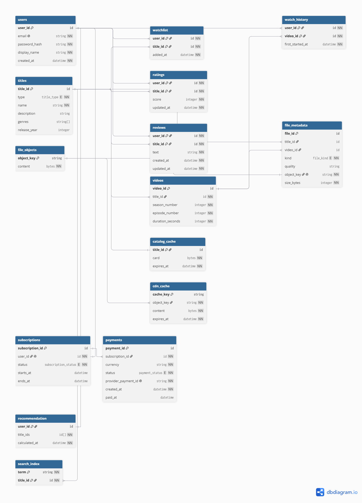

# Проектирование видеостримингового сервиса

## 1. Тема и целевая аудитория

**Тип:** видеостриминговый сервис на примере Netflix.

**Аудитория:** пользователи по всему миру. Для проекта принимаем 315 млн аккаунтов, MAU = 315 млн и DAU = 189 млн. Ориентир — 301,63 млн платных подписок Netflix в Q4 2024 [1]. Подписки и активные пользователи — разные метрики; MAU и DAU здесь являются допущениями.

**MVP:**

- Регистрация и авторизация.
- Главная страница с рекомендациями.
- Поиск и карточки фильмов и сериалов.
- Просмотр видео с выбором качества.
- «Мой список».
- Оценки.
- Чтение, написание, изменение и удаление отзывов на фильмы.

Рекомендации учитывают историю и оценки. Видео раздаётся через CDN; качество меняется по скорости соединения. Оценки и отзывы доступны после первого запуска видео. На фильм разрешён один отзыв от пользователя; выдача — страницами по 10 записей.

## 2. Расчёт нагрузки

### 2.1. Продуктовые метрики и RPS

| Метрика | Значение |
|---|---:|
| MAU | 315 млн |
| DAU/MAU, допущение | 0,6 |
| DAU | 315 млн × 0,6 = 189 млн |
| Рост аудитории за год, допущение по росту подписок Netflix [1][2] | 15,9% |

Частоты действий принимаются для модели. Средний RPS = `DAU × действий в сутки / 86 400`; пиковый — средний ×3.

| Действие | На DAU в сутки | Средний RPS | Пиковый RPS |
|---|---:|---:|---:|
| Главная / рекомендации | 3 | 6 562,5 | 19 687,5 |
| Поиск | 1,5 | 3 281,25 | 9 843,75 |
| Карточка тайтла | 5 | 10 937,5 | 32 812,5 |
| Запуск просмотра | 3 | 6 562,5 | 19 687,5 |
| «Мой список» | 0,4 | 875 | 2 625 |
| Оценка | 0,3 | 656,25 | 1 968,75 |
| Страница отзывов | 1 | 2 187,5 | 6 562,5 |
| Создание, правка или удаление отзыва | 0,01 | 21,875 | 65,625 |
| **Всего API** | **14,21** | **31 084,375** | **93 253,125** |

### 2.2. Хранение данных

Размеры записей принимаем по схеме из раздела 5: профиль — 300 Б, список и история — по 24 Б, оценка — 28 Б, отзыв — 1 032 Б.

| Данные | Записей на существующий аккаунт | Объём, КБ |
|---|---:|---:|
| Профиль | 1 | 0,3 |
| «Мой список» | 25 | 0,6 |
| История просмотров | 300 | 7,2 |
| Оценки | 60 | 1,68 |
| Отзывы | 3 | 3,096 |
| **Всего** | **389** | **12,876** |

Для каталога принимаем 10 000 тайтлов: 45% фильмов и 55% сериалов, по 25 эпизодов. Фильм длится 110 минут, эпизод — 48 минут. Получаем 142 000 видеоединиц и 118 250 часов контента.

Все версии качества занимают `0,3 + 1 + 3 + 7 = 11,3 ГБ/час`; мастер-копия — 80 ГБ/час; один постер — до 1 МБ/тайтл. Размеры метаданных — из раздела 5.

| Данные | Количество | Объём, ТБ |
|---|---|---:|
| Видео для раздачи | 142 000 видеоединиц | 1 336,23 |
| Мастер-копии | 142 000 видеоединиц | 9 460 |
| Метаданные, ключи файлов и постеры | 10 000 тайтлов, 142 000 видео, 720 000 файлов | До 0,010457 |
| Профили, история, избранное и оценки | 315 млн аккаунтов | 3,0807 |
| Отзывы | 945 млн записей | 0,97524 |
| **Всего** | | **≈ 10 800,29** |

Объёмы указаны без индексов, журналов и реплик. Итоги рассчитаны до округления; 1 КБ = 10³ байт, 1 ГБ = 10⁹ байт, 1 ТБ = 10¹² байт.

### 2.3. Прирост данных

Новый аккаунт содержит только профиль. Остальные данные появляются при действиях DAU. История создаёт запись при первом запуске видео. Для запаса считаем все просмотры, оценки и отзывы новыми, а операции со списком — добавлениями. Повторы и удаления уменьшают фактический прирост.

| Данные | Новых записей на DAU в сутки, до | Байт на запись | Прирост, ГБ/сутки |
|---|---:|---:|---:|
| История просмотров | 3 | 24 | 13,608 |
| Оценки | 0,3 | 28 | 1,5876 |
| «Мой список» | 0,4 | 24 | 1,8144 |
| Отзывы | 0,01 | 1 032 | 1,95048 |
| **Всего** | **3,71** | | **18,96048** |

Прирост на одного DAU: `3 × 24 + 0,3 × 28 + 0,4 × 24 + 0,01 × 1 032 = 100,32 байта/сутки`.

При линейном росте аудитории на 15,9% средний DAU за год: `189 млн × (1 + 0,159 / 2) = 204 025 500`. Новые профили: `315 млн × 15,9% = 50 085 000`. Их дальнейшая активность уже учтена в DAU.

Годовой прирост пользовательских данных: `(204 025 500 × 100,32 × 365 + 50 085 000 × 300) / 10¹² ≈ 7,49 ТБ`.

Принимаем 600 новых тайтлов в год: 270 фильмов и 330 сериалов. Прирост видео: `270 × 110 / 60 + 330 × 25 × 48 / 60 = 7 095 часов`; число видео — `270 + 330 × 25 = 8 520`, файлов — `8 520 × 5 + 600 = 43 200`.

| Данные | Расчёт | Прирост, ТБ/год |
|---|---|---:|
| Версии для раздачи | 7 095 ч × 11,3 ГБ/ч | 80,17 |
| Мастер-копии | 7 095 ч × 80 ГБ/ч | 567,60 |
| Метаданные, ключи файлов и постеры | `(600 × 4 877 + 8 520 × 28 + 43 200 × (305 + 256) + 600 × 10⁶) / 10¹²` | До 0,000628 |
| Пользовательские данные, включая отзывы | Активность DAU и новые профили | 7,49 |
| **Всего** | До округления строк | **≈ 655,26** |

## 3. Глобальная балансировка нагрузки

### 3.1. Группы трафика

| Условный домен | Трафик | Куда направляется |
|---|---|---|
| `api.stream.example` | Авторизация, каталог, поиск, избранное, оценки и отзывы | Amazon Route 53 (GeoDNS) возвращает адрес регионального AWS ALB; ALB выбирает сервер API |
| `video.stream.example` | Видеофайлы | CloudFront; узел доставки выбирает CDN-провайдер |
| `static.stream.example` | Постеры, JS и CSS | CloudFront; отдельные настройки кеширования для статики |

Домены условные.

### 3.2. Размещение и нагрузка

Используем четыре региона AWS [3]. Доли подписок Netflix принимаем за доли запросов [1]. Для каждого метода: `RPS региона = пиковый RPS метода × доля региона`; резерв — 20% сверх нагрузки при отказе одного региона по разделу 3.3.

| Площадка | Аудитория | Доля | Пик API, RPS | Мощность с резервом, RPS |
|---|---|---:|---:|---:|
| NA — Вирджиния | США и Канада | 29,7% | ≈ 27 696 | ≥ 70 724 |
| EU — Франкфурт | Европа, Ближний Восток, Африка | 33,5% | ≈ 31 240 | ≥ 70 724 |
| SA — Сан-Паулу | Латинская Америка | 17,7% | ≈ 16 506 | ≥ 19 807 |
| AP — Сингапур | Азиатско-Тихоокеанский регион | 19,1% | ≈ 17 811 | ≥ 21 374 |

Вирджиния выбрана как площадка на востоке США [4]; Франкфурт — в континентальной Европе [5]; Сан-Паулу — в Бразилии [6]; Сингапур — в Юго-Восточной Азии.

Для африканской аудитории доступны узлы CloudFront, в том числе в Кейптауне и Йоханнесбурге [7]; API работает во Франкфурте.

### 3.3. Порядок балансировки

Для глобального выбора региона API используем **Amazon Route 53 с географической политикой (GeoDNS)**: задаём направления по географии [8]. Порядок обращения, если готового DNS-ответа нет в кеше:

1. **DNS-запрос** через резолвер пользователя доходит до DNS-провайдера Amazon Route 53. Anycast позволяет обслуживать IP его DNS-сервера из нескольких точек; маршрут выбирается с участием BGP [9]. Это выбор узла DNS.
2. **GeoDNS** возвращает IP регионального балансировщика по географии DNS-запроса. Это выбор региона API.
3. **AWS Application Load Balancer (ALB)** принимает HTTP/HTTPS-запросы клиента и распределяет их между серверами API. В каждом регионе предусмотрен отдельный ALB в нескольких зонах доступности. Инфраструктурой балансировщика управляет AWS; мы настраиваем серверы назначения, правила и проверки доступности [13].
4. **Видео** плеер получает напрямую из CDN по подписанной ссылке от API [10][11].

**Отказ региона:** NA → EU, EU → NA, SA → NA, AP → EU. Из-за DNS-кеша переключение не мгновенное [12].

### 3.4. Доставка через CDN

Для видео и статики используем Amazon CloudFront: готовую сеть доставки с поддержкой подписанных ссылок [10][11]. Четыре выбранных региона относятся к API. Узлы CDN находятся на площадках провайдера по миру и не ограничены этими регионами [7].

Имена видео и статики направлены на CloudFront. При разрешении имени инфраструктура CDN выбирает узел доставки с учётом сетевой задержки [10]. Выбор узла между городами относится к глобальной балансировке; распределение запросов между серверами внутри узла — к локальной. Обоими уровнями CDN управляет провайдер.

API проверяет право на просмотр и выдаёт подписанную ссылку. Плеер обращается непосредственно в CDN. При наличии файла в кеше CDN отдаёт его; иначе получает из исходного хранилища сервиса и кеширует [10].

## 4. Локальная балансировка нагрузки

### 4.1. Балансировка запросов

Используем L7-балансировку, потому что за одним доменом API работают разные сервисы. Реализация — AWS ALB. В каждом регионе два ALB: публичный для клиентов и внутренний для межсервисных запросов. Внутренний доступен только из сети приложения [15]. Соответственно, всего 8 ALB. Далее выбирается экземпляр сервиса с наименьшим числом незавершённых запросов [14].

### 4.2. Отказоустойчивость

ALB и сервисы работают в двух зонах. Каждая рассчитана на всю нагрузку региона с резервом из раздела 3.2, чтобы выдержать отказ другой зоны. ALB проверяет экземпляры HTTP-запросами и исключает неисправные из балансировки [16]. При отказе региона переключаем трафик по разделу 3.3. Межсервисные вызовы ограничиваем тайм-аутами.

### 4.3. Терминация TLS (SSL)

TLS завершается на публичном ALB [17], далее используется HTTP в закрытой сети. Видео и статику обслуживает CloudFront, минуя региональные ALB.

## 5. Логическая схема БД

### 5.1. Логическая схема БД

### 5.2. Размеры данных

Исходные допущения из раздела 2: 315 млн аккаунтов; на аккаунт — 25 записей в списке, 300 запусков разных видео, 60 оценок и 3 отзыва. Каталог — 142 000 видео.

Допущения:

- ID, время и `size_bytes` — по 8 Б; остальные целые числа — по 4 Б; значение перечисления — 1 Б.
- Средний профиль — 300 Б, текст отзыва — 500 символов × 2 Б. Это расчётные допущения: UTF-8 допускает от 1 до 4 байт на кодовую точку. [RFC 3629](https://www.rfc-editor.org/rfc/rfc3629)
- Название ≤256 Б, описание ≤4 096 Б, жанры суммарно ≤512 Б; ключ файла ≤256 Б, обозначение качества ≤16 Б.
- На произведение загружаем один готовый постер размером ≤1 МБ.

| Таблица | Назначение | Число записей | Размер записи для расчёта | Объём |
|---|---|---:|---:|---:|
| `users` | Аккаунты | 315 млн | 300 Б | 94,5 ГБ |
| `watchlist` | «Смотреть позже» | 7,875 млрд | 2 × 8 + 8 = 24 Б | 189 ГБ |
| `watch_history` | Первый запуск видео | 94,5 млрд | 2 × 8 + 8 = 24 Б | 2,268 ТБ |
| `ratings` | Оценки произведений | 18,9 млрд | 2 × 8 + 4 + 8 = 28 Б | 529,2 ГБ |
| `reviews` | Отзывы | 945 млн | 2 × 8 + 2 × 8 + 1 000 = 1 032 Б | 975,24 ГБ |
| `titles` | Название, описание, жанры | 10 тыс. | До 8 + 1 + 4 + 256 + 4 096 + 512 = 4 877 Б | До 48,77 МБ |
| `videos` | Фильмы и эпизоды | 142 тыс. | 2 × 8 + 3 × 4 = 28 Б | 3,976 МБ |
| `file_metadata` | Владелец, качество, ключ и размер файла | 142 тыс. × 5 + 10 тыс. = 720 тыс. | До 3 × 8 + 8 + 1 + 16 + 256 = 305 Б | До 219,6 МБ |
| `file_objects` | Исходники, 4 готовых качества и постеры | 720 тыс. логических объектов | Ключ ≤256 Б; содержимое зависит от длительности и качества | Исходники — 9 460 ТБ; качества — 1 336,23 ТБ; постеры — до 10 ГБ; ключи — до 184,32 МБ |
| `catalog_cache` | Общая карточка произведения | До 10 тыс. | Карточка + ID и срок хранения | До 240 МБ полезных данных + 0,16 МБ ID и времени |
| `cdn_cache` | Копии готовых видео и постеров | Зависит от заполнения точек CDN | Ключи, содержимое и срок хранения | Сумма размеров сохранённых копий и служебных полей |

### 5.3. Нагрузка на чтение и запись

Пики API взяты из раздела 2; чтения БД указаны для промахов кеша.

Для расчёта принимаем:

- Главная подбирает рекомендации по жанрам просмотренных и оценённых произведений.
- Запуск добавляет историю; оценка и отзыв проверяют наличие первого запуска.
- Страница отзывов содержит до 10 записей; имена авторов получаем одной пакетной выборкой.
- API проверяет подписанный токен без чтения аккаунта.

| Таблица | Чтение, до обращений/с | Запись, до обращений/с |
|---|---:|---:|
| `users` | 6 562,5 выборок авторов | — |
| `watchlist` | r | w, где r + w = 2 625 |
| `watch_history` | 19 687,5 главных + 1 968,75 оценок + 65,625 отзывов = 21 721,875 | 19 687,5 попыток добавить первый запуск |
| `ratings` | 19 687,5 главных | 1 968,75 |
| `reviews` | 6 562,5 страниц | 65,625 созданий, изменений и удалений |
| `titles` | 19 687,5 главных + 9 843,75 поисков + 32 812,5 карточек + r = 62 343,75 + r | ≈ 0,000019, среднее при импорте |
| `videos` | 19 687,5 главных + 32 812,5 карточек + 19 687,5 запусков + 2 034,375 проверок = 74 221,875 | ≈ 0,000270, среднее при импорте |
| `file_metadata` | 62 343,75 + r + 19 687,5 запусков = 82 031,25 + r | ≈ 0,001370, среднее при импорте |
| `file_objects` | Запросы, дошедшие до источника файлов | ≈ 0,001370, среднее добавлений логических объектов |
| `catalog_cache` | 32 812,5 проверок карточки | 32 812,5 заполнений при промахах |
| `cdn_cache` | HTTP-запросы видео и изображений | Заполнения и обновления кеша |

### 5.4. Консистентность и распределение нагрузки

| Данные | Требование | Распределение по ключам |
|---|---|---|
| `users` | Email уникален; подтверждённые изменения аккаунта доступны при следующем входе | Вход — по `email`, профиль — по `user_id` |
| `watchlist`, `ratings`, `reviews` | Пользователь видит своё подтверждённое изменение; повтор запроса не создаёт дубликат | Запись — по паре `user_id, title_id`; у популярных фильмов значительно больше чтений отзывов |
| `watch_history` | Первый запуск сохраняется один раз; проверка права на отзыв видит подтверждённый запуск | По `user_id`; активные пользователи обращаются чаще |
| `titles`, `videos`, `file_metadata` | Карточка публикуется после загрузки файлов; допускаем отставание общей карточки в кеше до 60 с | Основной спрос приходится на популярные `title_id` и `video_id` |
| `file_objects` | По одному ключу доступны одни и те же байты; новая версия получает новый ключ | Премьеры создают повышенную нагрузку на отдельные `object_key` |
| `catalog_cache`, `cdn_cache` | Потеря кеша не приводит к потере исходных данных | Популярные карточки и файлы читаются значительно чаще остальных |

## Список источников

1. [Netflix Q4 2024 Shareholder Letter](https://s22.q4cdn.com/959853165/files/doc_financials/2024/q4/FINAL-Q4-24-Shareholder-Letter.pdf)
2. [Netflix Q4 2023 Shareholder Letter](https://s22.q4cdn.com/959853165/files/doc_financials/2023/q4/NEW-FINAL-Q4-23-Shareholder-Letter.pdf)
3. [AWS — регионы и зоны доступности](https://docs.aws.amazon.com/global-infrastructure/latest/regions/aws-regions.html)
4. [Equinix — датацентры и межоператорские соединения в районе Вашингтона и Ашберна](https://www.equinix.com/data-centers/americas-colocation/united-states-colocation/washington-dc-data-centers)
5. [DE-CIX Frankfurt](https://www.de-cix.net/en/locations/frankfurt)
6. [IX.br — подключение в Сан-Паулу](https://docs.ix.br/adesao/sp)
7. [Amazon CloudFront — география узлов доставки](https://aws.amazon.com/cloudfront/features/)
8. [Amazon Route 53 — политики маршрутизации](https://docs.aws.amazon.com/Route53/latest/DeveloperGuide/routing-policy.html)
9. [RFC 4786 — Operation of Anycast Services](https://www.rfc-editor.org/rfc/rfc4786.html)
10. [Amazon CloudFront — выбор узла и доставка контента](https://docs.aws.amazon.com/AmazonCloudFront/latest/DeveloperGuide/HowCloudFrontWorks.html)
11. [Amazon CloudFront — ограничение доступа и подписанные URL](https://docs.aws.amazon.com/AmazonCloudFront/latest/DeveloperGuide/PrivateContent.html)
12. [Amazon Route 53 — TTL](https://docs.aws.amazon.com/Route53/latest/DeveloperGuide/resource-record-sets-values-basic.html#rrsets-values-basic-ttl)
13. [AWS Application Load Balancer](https://docs.aws.amazon.com/elasticloadbalancing/latest/application/introduction.html)
14. [AWS ALB — алгоритмы балансировки](https://docs.aws.amazon.com/elasticloadbalancing/latest/application/edit-target-group-attributes.html)
15. [AWS — публичные и внутренние балансировщики](
